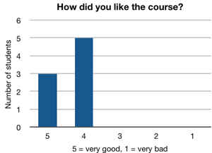
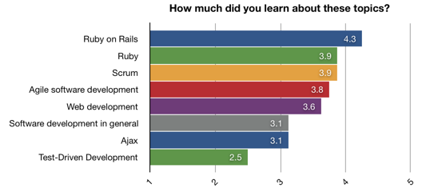
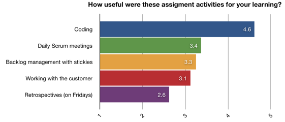
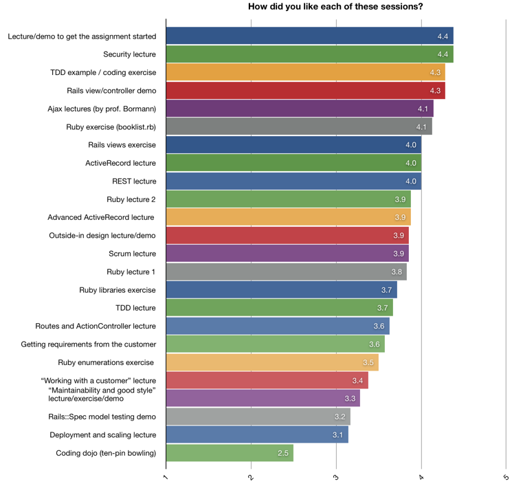
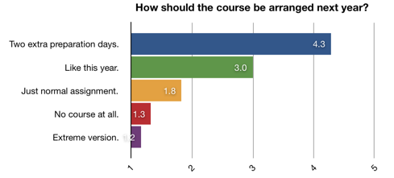

Experiences from Agile Web Development course, spring 2008
==========================================================

Antti Tarvainen, June 1, 2008

Abstract
--------

We organized a thirteen-day Agile Web Development course at Department of Software Systems at Tampere University of Technology in April 2008. The goal of the course was to teach students agile development and web programming in a fast-paced project with real customers. 

The daily sessions started at 9:00 each morning and lasted till 16:00, with a one-hour lunch break at the middle of the day. First three days were preparation for the project assignment. On the remaining ten days, lectures and exercises were intertwined with project work. 

Ten students enrolled to the course. Students were divided into five teams of two, with each team working on a separate project. By the end of the course, all teams delivered working software to their customers - albeit without deployment to production use. The customers in general were happy with the results.

We did not achieve all of the educational goals of the course. In particular, test-driven development was planned to be used in project work, but in the end was not. The technical difficulties in learning a new programming language and a new framework were higher than expected.

Feedback from students was very positive.

We propose that the same course be given next year with a few changes. Most notably, to ease wrestling with technical issues during the project work and to allow more focus on agile programming practices, the course preparation period should be lengthened from three days to five, bringing the total length of the course to fifteen days. We also propose creation of another course, "Agile product ownership", 1 cp.

Introduction
------------

This report describes the Agile Web Development (AWD) course at Department of Software Systems at Tampere University of Technology in April 2008.

The course was organized for the first time this year. The purpose of this report is to document the experiences from the course and to help decide what to do with the course next year. Since the course was novel in many ways, teachers of other courses may find this report useful as well.

In the rest of this report, we describe (a) the educational goals of the course, (b) how the course was structured to achieve those goals, (c) lecturer's observations, (d) the feedback from students and customers, and finally (e) conclusions and changes we propose for the next year.

Educational Goals
-----------------

We had two educational goals.

1. To teach students agile development practices. 
2. To teach students web programming with a modern web framework.

### Agile development practices

Agile software development is a fuzzy term that encompasses a lot of different methodologies. The common substance between different agile methodologies is their set of values: beliefs about what is important in software development. Agile development differ from traditional software development by the stress it puts on these values. The most widely cited description of agile values is [Agile Manifesto](http://agilemanifesto.org/).

In our view, values are the most important part of agile development. However, appreciation of the values only comes with experience. Therefore the focus on this course was not on teaching values, but practices, .

Agile practices are methods to achieve agile values. There is a large number of them, out of which we chose a few. The priority of the course was to teach:

* **Test-driven development** (more specifically behaviour-driven development), and
* **Scrum project management**.

On a lower priority, we planned to include:

* **Continuous integration**,
* **Refactoring**,
* **Pair programming**, and
* **Retrospectives**.

### Web programming with a modern web framework

Students were assumed to have the theoretical knowledge of web programming equal to course OHJ-5100 Web Programming. (Most students took the courses in conjunction. See Appendix for more information.)

The goal of the Agile Web Development course was to give students practical web programming skills that could be applied beyond the technology used at the course.

Structure
---------

The course lasted 13 days, starting on Wednesday, April 9, 2008, and ending on Friday, April 25, 2008. The entire course was held in one computer lab. Sessions started each day at 9:00 and lasted till 16:00. There was a lunch break from 12:00 to 13:00, and shorter breaks two times a day. This totaled to roughly 13*6 = 78 hours of work. No homework was given. Passing the course required continuous or nearly continuous attendance to sessions, and finishing the project work satisfactorily.

The setting of the course emulated real-life software work in a fast-paced project. The first three days were preparation. The other two weeks were project work, divided into two one-week Scrum sprints. Project work was intertwined with lectures and exercises. The topics of the lectures were various aspects of Ruby on Rails, web development and agile development.

Ten students enrolled to the course. Five of them were Finnish students from TUT, the other five, foreign exchange students. Most of the students had software development as their major subject. The range of skills was wide, but even the worst students had good enough skills for attending, and eventually completing the course.

For a more detailed description of the course structure, see the [course diary](diary.html).

Experiences from the course
---------------------------

The following describes our experiences from the course. For lecturer's day-to-day experiences, see the [course diary](diary.html).

### Things that worked well

* **Students worked on their projects enthusiastically.** The lecturer had to remind the students of the lecture breaks and even then many of them often decided to skip them. On many days, some of the students continued working after 16:00. (What makes this remarkable is that the course corresponded with the first warm sunny days of the spring.)

* **Ruby on Rails was a good tool for learning agile web development.** Agile methods prefer to spend most of the project in iterative development phase instead of planning activities. This presents a challenge to a short university course. Because of its "convention over configuration" philosophy, starting a Rails project is very fast. The time spent on making architectural choices is minimized, and the iterative phase can start on the first day of project work. Our observations on the course supported this assessment.

* **Using RSpec to describe Ruby exercise requirements worked well.** The test-driven development tool we used on the course was RSpec. The requirements for Ruby exercises were described as RSpec test cases. This way the students got familiar with RSpec on the first day, and the barrier of learning to use the tool for test-driven development on the second day was lower.

### Things that didn't go according to the plan

* **The first week's exercises took longer than expected.** This added to the technical detail burden of the second week. The original topic plan for the preparation period was as follows:
  
  * Wednesday: Introduction. Basics of Ruby.
  * Thursday: Test-driven development.
  * Friday: Basics of Ruby on Rails. Scrum project management.
  
  The actual topics of the first three days were:
  
  * Wednesday: Introduction. Very basics of Ruby.
  * Thursday: Test-driven development.
  * Friday: More Ruby. Very little of Ruby on Rails.
  
* **Students paid more attention to technical details than to following agile practices.** In retrospect this is easy to understand. To finish the project, it is necessary to work out technical difficulties. Agile practices, on the other hand, are not mandatory to finishing the work. Because there was a lot to learn, students didn't pay as much attention to the optional part of the subject.

  * **None of the teams used test-driven development in the project work:** We had originally planned to mandate test-driven development, but decided against it after the first week. Since learning the technical details took more time than planned, we assessed that the combined burden of learning technical details and starting test-driven development would be too much for the students. We gave the students a choice, and none of them decided to use test-driven development.

  * **The teams varied a lot in their adoption of Scrum.** The best team divided the customer wishes to reasonable user stories and the user stories further to individual tasks. They split their user stories to the two sprints and regularly updated their backlogs to describe their progress. On the other hand, the backlog of the worst team didn't have a clear distinction between stories and tasks. There was no sense of completion at the end of the first sprint, and the team didn't update their backlogs regularly. Their backlog didn't give a clear picture of the status of their project.

* **There was not enough dialogue with the customer.** The team and the customer should collaborate to make the most suitable software possible. The customer knows what he wants and understands the domain area. The team understands the implementation constraints. Without good dialogue there is a danger that a wrong problem is solved, or that the solution to the problem is much more expensive than needed. Many teams collaborated with their customer too little after their initial meeting.

### Other observations

* **There was a noticeable difference between the Finns and the foreign students.** The Finns seemed more ready for the course, and in the end got better results. There are many possible reasons for this: communication difficulties, prior skills, the lecturer being a TUT alumnus, etc. The largest difference was the attitude in learning agile development, Finns being more interested in it. In learning web development and finishing the project, all students showed very good attitude.

Feedback
--------

### Student feedback

Student feedback was collected on the last day of the course. The feedback was collected anonymously on a [feedback form](feedback_form.pdf). Two students couldn't attend the session when this was done, so only eight students gave feedback. The following subsections show the results.

#### Course in general

General satisfaction with the course was asked with the question "How was the course?" The answers averaged 4.4 where grade 5 is "very good" and grade 1 "very bad".

Comments by students (editorialized):

* "Time schedule was tight." (the student gave the grade 5)
* "More Ruby on Rails exercises at the beginning." (4)
* "I can recommend this to others." (4)

#### Learning by topic

"How much did you learn about these topics?" 5 = very much, 1 = very little.

Comments by students (editorialized):

* "It's hard to estimate when you don't know how much there is to learn."
* Test-Driven Development: "Actually I don't want to learn any TDD. Time for that later, when I am a better programmer." (3)

Analysis:

* This is a difficult question to analyze. For example, a student may give a low rating to a topic because he/she already knew much about it, or because he/she didn't understand much about what the teacher was saying. We must be careful if we draw conclusions from these answers.

* The students felt they learned a lot about Ruby and Rails technologies, but less about more general subjects.

#### Usefulness of assignment activities

"How useful were these assignment activities for your learning?" 5 = very useful, 1 = very useless.

Comments by students (editorialized):

* Retrospectives: "In a bigger project could be more useful." (2)

Analysis:

* The most technical part of the work, coding, was perceived most useful. This is in line with the previous question.

#### Sessions

"How did you like each of these sessions? (Leave the line empty if you cannot remember.)" 5 = very good, 1 = very bad.

In the chart below, the names of the different sessions are shown in a shortened form. For the original names with explanations, see the [feedback form](feedback_form.pdf). 

Comments by students (editorialized):

* Ruby exercise (booklist.rb): "It took me a long time to understand what the test files were for. I didn't understand it from your speech, and I was not alone." (4)
* Ruby enumerations exercise: "Didn't lear so much on other's explanations." (3)
* Ruby enumerations exercise: "Didn't seem very efficient for learning." (3)
* Ruby enumerations exercise: "Hard to read others handwriting." (3)
* TDD lecture: "There should be more TDD on other programming courses also." (4)
* Coding dojo: "Too many cooks." (3)
* Coding dojo: "A Big mess." (1)
* Ruby libraries exercise: "Finding info by yourself was more useful than demos." (2)
* Ruby libraries exercise: "Didn't lear so much on other's explanations." (4)
* Rails view/controller demo: "Exercises where lecturer demonstrated, and we mimicked, were good, because Eclipse and other tools were a little complicated in the beginning." (-)
* Working with customer: "Boring." (2)
* Working with customer: "Other courses teach the same things." (2)
* Getting requirements from the customer: "Defining your own assignment is good." (4)
* REST lecture: "Made things clearer about Ruby on Rails 2.0." (5)
* REST lecture: "I didn't understand what it was about because I came in late." (-)
* Ajax lectures (by prof. Bormann): "Lectures were interesting, although not much information." (4)
* Ajax lectures (by prof. Bormann): "Slides lacked server side code that would have helped getting started." (4)
* Deployment and scaling lecture: "A little 'out-of-scale' - not very relevant." (3)
* Maintainability and good style: "Useless and boring." (-)
* Security lectures: "There should be more of these practical software security lectures." (4)

Analysis:

* Students liked sessions that were immediately useful to them, such as the "lecture/demo to get the assignment started", "rails view/controller demo", "Ajax lectures by prof. Bormann", and "Ruby exercise (booklist.rb)".

* The success of the "TDD example / coding exercise" is a surprise when compared to other TDD topics. It is also a surprise because it seemed during the exercise that all students didn't really understand TDD.

* [Coding dojo](http://wiki.agilefinland.com/?CodingDojo) is an exercise for learning TDD where two developers pair for coding and the other students watch. Every five minutes one of the watchers takes place of one of the coders. It is quite difficult to write a good program that way, and thus the exercise can be frustrating. Besides learning TDD, the dojo helps understand how other programmers think.

  There are ways to improve the coding dojo exercise for the next year. We are probably going to give it another try. If the students still don't like it next year, we will probably drop the exercise in the future.

#### Changes for the next year

"We try to improve the course for the next year. In your opinion, how do these alternative course formats sound compared to this yearʼs format?" 5 = much better, 1 = much worse. "Just as it was this time" was pre-filled with value 3.

In the chart below, the names of the different options are shown in a shortened form. For the original names with explanations, see the [feedback form](feedback_form.pdf). 

Comments by students (editorialized):

* "5-7 days of preparation."
* "After lunch lectures were quite advanced topics."
* "It seems to me that there were no lectures about Ruby on Rails, but we just started with projects. A lot of things should be easier with some background."
* "Make some basic example project with comments that describe what every line does."
* "Ajax lecture should be earlier in the course."
* "Too many lectures per day during the assignment work. They distracted from the work too much."
* "More focus on agile development and time ('we estimated this takes x hours but it took y, why?')"
* "Since all groups used Ajax, it would be useful to practice it one day at the beginning of the course."
* "More books wouldn't hurt."
* "In the beginning, more about how variables are transmitted between controllers and views (via HTTP and so on)."
* "Perhaps user stories should have been reviewed together in the beginning to make them better."
* "Pure agile part could have been pruned to more about Ruby on Rails."
* "More code examples to show how to do things 'correctly' and beautifully."
* Two extra preparation days: "Could have a simple mini-assignment before the real one." (5)
* Two extra preparation days: "The project could be started like this time, but the model layers should be discussed together in the beginning of the course." (4)
* Extreme version: "Sounds like a normal practice assignment." (1)
* Extreme version: "Oh my god! Do you want to kill us with work!?" (1)

Analysis:

* The explanation for "extreme version" in the feedback form was "12 days straight, including weekend, 9-21 each day". This is the way a similar course is taught in the University of Bremen. Although the course in Bremen is well-liked by its students, the idea of such a course was not popular among the students of the TUT course.

#### The best things about the course

Comments by students (editorialized):

* "It showed me a new way to develop web applications. It's the best way I've seen."
* "Doing Rails!"
* "Understanding what agile development should be and not doing it -> learning by mistakes."
* "After working 9-16, you could leave the assignment and go home."
* "Help was always close."
* "Real customers."
* "New programming language with lots of useful features."
* "Team project."
* "We could concentrate properly on one thing, which is rare in the studies."
* "Getting to know the other students."
* "Lot of stuff in a tight packet."

#### The worst things about the course

Comments by students (editorialized):

* "No Ruby on Rails lectures at the beginning."
* "We did not know Ruby and Rails, and had a lot of problems."
* "Not enough Ruby on Rails at the beginning of the assignment."
* "It is hard to work with this course 9-16 and then after it with other studies."
* "The weather outside was too good for the last week."

#### Other comments

Comments by students (editorialized):

* "More TDD?"
* "Great course!"
* "For the department: more short courses like this and less desperate students stuck with irrelevant issues alone."

### Customer feedback

Feedback from the five customers was collected via email after the assignments were finished. 

Customers were generally happy with the finished assignments. Their biggest grievance was that the projects were not deployed for use. (Some teams provided their customer with installation instructions, others just handed over the source code.)

We asked asked the customers for their feedback about the organization of the course. Four customers answered the question, giving an average grade of 3.75 out of 5.

Regarding the organization of the course, two customers wished for a longer course, so that they could have more and better meetings with the students. One customer wished for better instructions for the preparation of the project. One customer wished for more feedback about his work as a customer.

Conclusions
-----------

The course was a partial success. Three goals were set for the course: to teach agile values, agile practices and web programming. Out of these only the last one was realized with satisfactorily. However, the student feedback from the course was very positive.

We believe that the course - implemented even as it was this year - would be a valuable addition to the department's course palette. The course can be made still much better. Therefore, we propose that the course be given next year, but with a few changes.

### Planned changes for the next year

We plan to make the following changes for the next year's course.

* **The course will be lengthened from 13 days to 15 days.** This will allow for more preparation before the actual assignment work begins. The focus of the preparation will be teaching technical details. This way the work on the assignment should feel less painful and more agile. 
  
  Our plan for the structure of the first week looks like this:
  
  1. Monday: Introduction to the course. Learning to use the programming tools. Learning Ruby.
  2. Tuesday: Learning more Ruby.
  3. Wednesday: Learning Rails and the tool support for it.
  4. Thursday: Rails exercise: small project from start to end.
  5. Friday: Learning TDD as it is used with Rails.

  This should also give students a better chance to estimate how much they can achieve during the project, and the Scrum sprint goals will be more meaningful. The two weeks of project work will be much like they were this year, only more structured, and possibly with additional lectures about agile topics.

* **The use of test-driven development will be mandated.** With all the other things they need to learn, this may feel painful to students at first. This is exactly the reason why students are unlikely to adopt it by themselves, and why it should be mandated.

* **The preparation of the sprints will be guided more carefully.** This will give students a better understanding of Scrum, and help them work in a more agile way.

* **The software will be deployed. The first deployment is at the end of the first sprint.** (The deployment can be either to a test server provided by the course or to a server of the customer.) This will give students a specific goal and help customers get what they want. Most importantly, a project can not be described as agile unless it produces working software at the end of sprints. Without deployment, software is not really working, and thus deployment must be part of the project from the very beginning.

* **Specific times will be set aside for customer interaction.** This is to make sure that there will be plenty of opportunities for customers to give feedback.

The overall theme in these changes is to move the responsibility of agile process planning from the students to the lecturer.

### Proposal for another course: Agile product ownership, 1 cp. 

The project customers wished for more guidance in preparing, monitoring and steering the project. This is a reasonable request, and we therefore propose a creation of another course. The students of this course would work as customers on the Agile Web Development course. The name of the course would be "Agile product ownership" and its size one credit point.

The course would consist of lectures, a workshop, and the project work. The lectures and the workshop would prepare customers for the Agile Web Development project. During the project work, the customers would get useful feedback on how to improve their work. 

Another reason why this course is needed comes from our experience in the software industry. The weakest link of a software project is often the customer. Many a project would benefit from having a customer who knows how to monitor progress and how he can (and cannot) help the project. By organizing this course the department would give further recognition to the importance of training software project customers. The department would also gain experience that would help prepare larger such courses in the future.

Appendix
--------

### The original course at University of Bremen

The course was modeled after an Agile Web Entwicklung course held at the University of Bremen by prof. Carsten Bormann.

The Bremen course is a much more intensive period, consisting of 12 days of 12 hour work, including one weekend. There were two reasons why the intensity of the Bremen course was not emulated in the Tampere course.

* Such intensity is foreign to the culture at TUT. We feared it would be difficult to attract students to the course. This was later confirmed by student feedback. It could also be difficult to convince the university administration to approve such a course. 
* Working 12 hour days is opposite to the ideals of agile development. Our goal was to teach students sustainable practices that they could later mimic on their careers.

### Credit points and relation to OHJ-5100 Web programming course

The Agile Web Development course was offered in two ways: (a) as an independent course and (b) in conjunction with OHJ-5100 Web Programming course. The independent course was worth 3 credit points. Passing the independent course required attendance to teaching and finishing the assignment successfully.

In conjunction with OHJ-5100, the course replaced the normal J2EE assignment, two lectures and three weekly exercises of OHJ-5100. The total course credit was 6 credit points: 4 credit points from OHJ-5100 and 2 credit points from 2 credit points from AWD. Passing the two courses required attendance to AWD teaching, successfully finishing the AWD assignment, finishing at least four OHJ-5100 weekly exercises and passing the OHJ-5100 exam.

Of the ten students enrolled to the course, nine took the course in conjunction with OHJ-5100.

